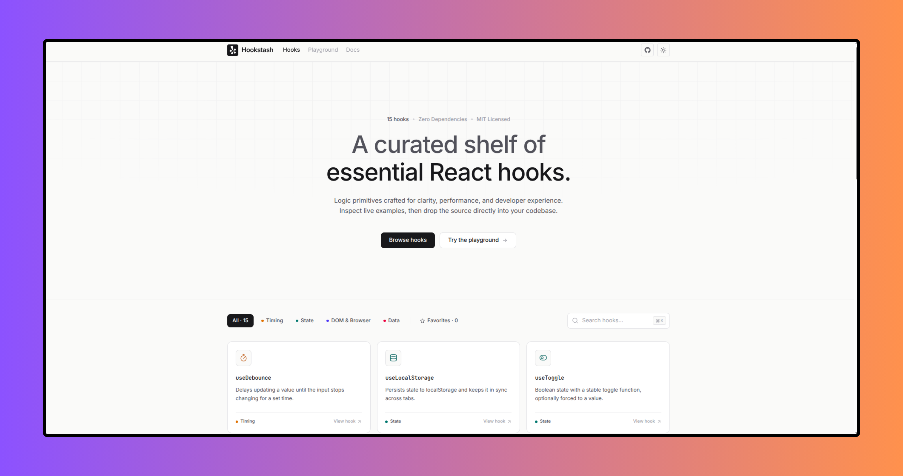

<p align="center">
  <a href="https://hookstash.vercel.app/">
    
  </a>
</p>

<div align="center">

# Hookstash

**A small, working shelf of React hooks - browse, preview live, copy, ship.**

[Live demo](https://hookstash.vercel.app/) · [Report a bug](https://github.com/byllzz/hookstash/issues)

</div>


## About

Hookstash is a curated library of React hooks. Every hook is a single,
dependency-free TypeScript file - there's no package to install, no version
to pin, no bundle weight to account for. Open a hook, watch its live demo,
copy the source, paste it into your project.

It also ships with an in-browser **Playground** where you can write a
component using any hook in the library and see it render instantly,
compiled client-side with Babel - nothing is sent to a server.

## Features

- **15 production-ready hooks** across four categories: Timing, State,
  DOM & Browser, and Data
- **Live demos** for every hook - see real behavior, not just a docstring
- **Live Playground** - write and run React code against the whole hook
  library, right in the browser
- **Command palette** (`⌘K` / `Ctrl+K` / `/`) - search and jump to any hook
  instantly
- **Favorites** - star hooks you use often; saved locally via the library's
  own `useLocalStorage` hook
- **Light / Dark / System theme**, persisted, with no flash on reload
- **Real documentation page** with a sticky table of contents
- **Side-by-side hook detail view** - source on the left, live demo pinned
  on the right

## Tech stack

| Layer | Choice |
|---|---|
| Framework | React 19 |
| Language | TypeScript |
| Build tool | Vite 8 |
| Styling | Tailwind CSS v4 |
| Icons | lucide-react |
| In-browser compiler (Playground) | @babel/standalone |

## Getting started

```bash
git clone https://github.com/byllzz/hookstash.git
cd hookstash
npm install
npm run dev
```

Build for production:

```bash
npm run build
npm run preview
```

## Project structure

```
src/
  hooks/                 real, working hook implementations (the actual library)
    useDebounce.ts
    useThrottle.ts
    useInterval.ts
    useToggle.ts
    useLocalStorage.ts
    usePrevious.ts
    useClickOutside.ts
    useMediaQuery.ts
    useOnScreen.ts
    useCopyToClipboard.ts
    useWindowSize.ts
    useHover.ts
    useKeyPress.ts
    useEventListener.ts
    useFetch.ts

  components/
    demos.tsx            live demo component for each hook
    Gallery.tsx           hero + filters + search + card grid
    HookDetail.tsx         source/demo detail page
    TopNav.tsx             header: logo, nav links, search, theme, GitHub
    CommandPalette.tsx      ⌘K search overlay
    ThemeToggle.tsx
    Docs.tsx                documentation page with sticky TOC
    Playground.tsx          live in-browser code editor + preview
    Faq.tsx
    Footer.tsx
    TopLoader.tsx            thin progress bar on navigation
    CodeBlock.tsx            lightweight syntax highlighting
    CopyButton.tsx

  lib/
    registry.tsx           wires each hook's source (via Vite's `?raw`) + demo together
    meta.ts                 category + icon per hook
    useTheme.ts
    docsContent.ts           documentation page copy
```

## Adding a new hook

1. Add the implementation to `src/hooks/useYourHook.ts`.
2. Add a small live demo component to `src/components/demos.tsx`.
3. Register both in `src/lib/registry.tsx`, and add its category/icon in
   `src/lib/meta.ts`.
4. If it's genuinely useful in the Playground sandbox, add it to the
   `hookNames` map in `src/components/Playground.tsx`.

It will show up in the gallery, filters, search, and command palette
automatically.

## Design principles

- **No dependency lock-in** - every hook is copy-paste, not `npm install`.
- **Show, don't just tell** - every hook has a working demo, not just a
  code sample.
- **Quiet UI** - no gradients, no neon, no unnecessary motion. Hairline
  borders, a muted accent color, and generous whitespace.

## Contributing

Pull requests are welcome. Please keep new hooks dependency-free, include
a demo, and follow the existing code style (see any file in `src/hooks`
for the expected shape: a short docblock, clean TypeScript, proper
cleanup in `useEffect`).

## Deploy

Deployed on Vercel. Push to your repo and import it in the Vercel dashboard - no config needed, it's a standard Vite app.

If you enjoyed this project, consider giving it a ⭐ on GitHub. It helps others discover the project and motivates future improvements.

# License (MIT)

This project is licensed under the MIT License.

```text
MIT License

Copyright (c) 2026 Bilal Malik

Permission is hereby granted, free of charge, to any person obtaining a copy
of this software and associated documentation files (the "Software"), to deal
in the Software without restriction, including without limitation the rights
to use, copy, modify, merge, publish, distribute, sublicense, and/or sell
copies of the Software, and to permit persons to whom the Software is
furnished to do so, subject to the following conditions:

The above copyright notice and this permission notice shall be included in all
copies or substantial portions of the Software.

THE SOFTWARE IS PROVIDED "AS IS", WITHOUT WARRANTY OF ANY KIND, EXPRESS OR
IMPLIED, INCLUDING BUT NOT LIMITED TO THE WARRANTIES OF MERCHANTABILITY,
FITNESS FOR A PARTICULAR PURPOSE AND NONINFRINGEMENT. IN NO EVENT SHALL THE
AUTHORS OR COPYRIGHT HOLDERS BE LIABLE FOR ANY CLAIM, DAMAGES OR OTHER
LIABILITY, WHETHER IN AN ACTION OF CONTRACT, TORT OR OTHERWISE, ARISING FROM,
OUT OF OR IN CONNECTION WITH THE SOFTWARE OR THE USE OR OTHER DEALINGS IN THE
SOFTWARE.
```

## Author


### Bilal Malik

[](https://x.com/bilalmlkdev)
[](https://github.com/byllzz)
[](https://bilalmlkdev.vercel.app)


© 2026 Hookstash. All rights reserved.
